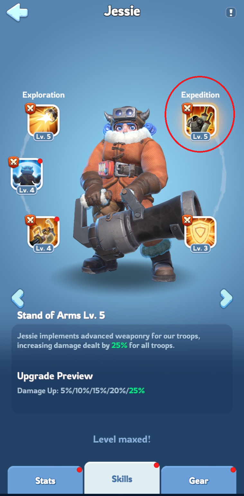
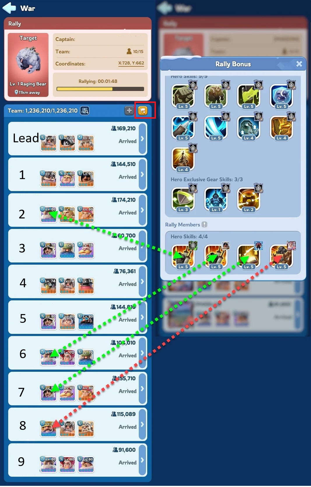

# Whiteout Survival: Bärenjagd-Rallye-Guide

## 🌍 Sprachauswahl
🇬🇧 [English](GUIDE_EN.md) | 🇩🇪 [Deutsch](GUIDE_DE.md) | 🇪🇸 [Español](GUIDE_ES.md) | 🇫🇷 [Français](GUIDE_FR.md) | 🇷🇺 [Русский](GUIDE_RU.md) | 🇸🇦 [العربية](GUIDE_AR.md)

---

## TL;DR

- **Rallye-Anführer**: Nutze deine drei stärksten Helden mit offensiven Fähigkeiten.
- **Rallye-Mitglieder**: Trete mehreren Rallyes bei und verwende **Jessie**, **Jasser**, **Seo-yoon** oder **Jeronimo** als ersten Helden (erster Heldenplatz), um den Gesamtschaden zu erhöhen. Falls das nicht möglich ist, nutze **keine** Helden.
- **Nutze Truppen-Voreinstellungen**: Speichere deine Helden- und Truppenkonfigurationen in Voreinstellungen, um schneller und mit weniger Fehlern Rallyes beizutreten oder zu erstellen. [Siehe Voreinstellungs-Guide](https://outof.games/realms/whiteoutsurvival/guides/473-how-to-setup-troops-formations-in-whiteout-survival/)

---

## Für Rallye-Mitglieder (Beitritt)

- **Wahl des ersten Helden**: Setze **Jessie**, **Jasser**, **Seo-yoon** oder **Jeronimo** in den ersten Heldenplatz. Ihre Fähigkeiten können den Schaden aller Truppen um bis zu **25%** erhöhen.
- **Fähigkeitslevel**: Stelle sicher, dass die **erste Expeditionsfähigkeit** deines Helden auf dem höchstmöglichen Level ist, um den maximalen Effekt zu erzielen.
- **Truppenaufstellung**: Sende deine **stärksten Truppen**, wobei du dich auf **Scharfschützen** und **Lanzenträger** konzentrieren solltest, um optimalen Schaden zu verursachen.

---

## Rallye-Mechaniken verstehen

- **Beitragsfähigkeiten**: Nur die **erste Expeditionsfähigkeit** der **ersten vier Mitglieder**, die der Rallye beitreten, trägt zu den Buffs der Rallye bei.

  

- **Fähigkeitsüberschreibung**: Falls ein später beigetretenes Mitglied eine **höherstufige Fähigkeit** hat als ein früheres, ersetzt die höherstufige Fähigkeit die niedrigere in den Rallye-Buffs.
- **Schwache Buffs vermeiden**: Verwende **keine** Helden, deren **erste Expeditionsfähigkeit** den Schaden nicht erhöht, da dies die Effektivität der gesamten Rallye verringern kann.

  

---

## Tipps zur Truppenaufstellung

- **Scharfschützen**: Hohe Angriffswerte machen sie ideal, um maximalen Schaden zu verursachen.
- **Lanzenträger**: Dienen als effektive Sekundär-Damage-Dealer.
- **Infanterie**: Während sie in anderen Events für die Verteidigung wichtig sind, verursachen sie in der Bärenjagd **weniger Schaden**.

---

## Für Rallye-Anführer

- **Heldenauswahl**: Setze **drei Helden** mit **starken offensiven Expeditionsfähigkeiten** ein. Ihre kombinierten Fähigkeiten beeinflussen den Gesamtschaden der Rallye erheblich.
- **Heldenausrüstung**: Rüste deine Helden mit **hochwertiger Ausrüstung** aus, um ihre Effektivität zu steigern.
- **Zusätzliche Buffs**: Nutze **Chef-Ausrüstung, Chef-Talismane und Haustiere**, um den Angriff und die Tödlichkeit deiner Truppen weiter zu erhöhen.
