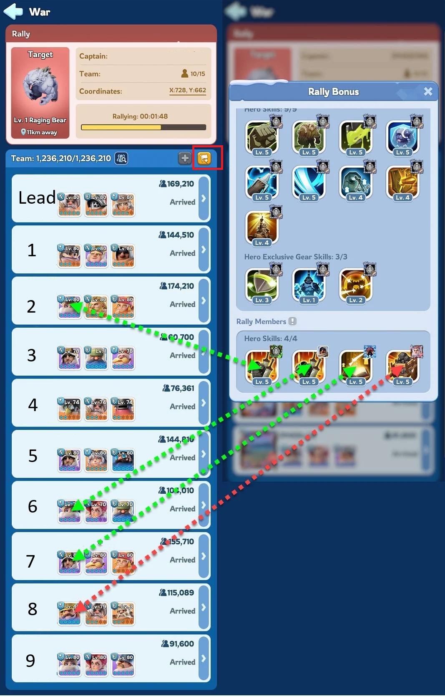

# Whiteout Survival: Bear Hunt Rally Guide

## 🌍 Language Selection
🇬🇧 [English](GUIDE_EN.md) | 🇩🇪 [Deutsch](GUIDE_DE.md) | 🇪🇸 [Español](GUIDE_ES.md) | 🇫🇷 [Français](GUIDE_FR.md) | 🇷🇺 [Русский](GUIDE_RU.md) | 🇸🇦 [العربية](GUIDE_AR.md)

---

## TL;DR

- **Rally Leaders**: Use your three strongest heroes with offensive skills.
- **Rally Members**: Join multiple rallies using **Jessie**, **Jasser**, **Seo-yoon**, or **Jeronimo** as your lead hero (first hero slot) to boost overall damage. If this is not possible, do **not** use any heroes.
- **Use Squad Presets**: Save your hero and troop configurations in squad presets to join and create rallies faster with fewer mistakes. [See preset guide](https://outof.games/realms/whiteoutsurvival/guides/473-how-to-setup-troops-formations-in-whiteout-survival/)

---

## For Rally Members (Joining)

- **Lead Hero Choice**: Place **Jessie**, **Jasser**, **Seo-yoon**, or **Jeronimo** in the first hero slot. Their skills provide up to a **25% damage boost** to all troops.
- **Skill Levels**: Ensure that your lead hero’s **first expedition skill** is at the highest possible level to maximize its effect.
- **Troop Deployment**: Send your **strongest troops**, focusing on **Marksmen** and **Lancers** for optimal damage.

---

## Understanding Rally Mechanics

- **Skill Contribution**: Only the **first expedition skill** of the **first four members** joining the rally contributes to the rally's overall buffs.

  

- **Skill Overwriting**: If a later joiner has a **higher-level skill** than an earlier member, the higher-level skill will replace the lower one in the rally’s buffs.
- **Avoiding Weak Buffs**: Do **not** use heroes whose **first expedition skill** does not enhance damage, as this can reduce the rally’s overall effectiveness.

  

---

## Troop Composition Tips

- **Marksmen**: High attack stats make them ideal for maximizing damage.
- **Lancers**: Serve as effective secondary damage dealers.
- **Infantry**: While essential for defense in other events, they contribute **less damage** in Bear Hunts.

---

## For Rally Leaders

- **Hero Selection**: Deploy **three heroes** with **strong offensive expedition skills**. Their combined skills significantly impact the rally's damage output.
- **Hero Gear**: Equip your heroes with **high-level gear** to enhance their effectiveness.
- **Additional Buffs**: Utilize **Chief Gear, Chief Charms, and Pets** to further boost troop attack and lethality.
